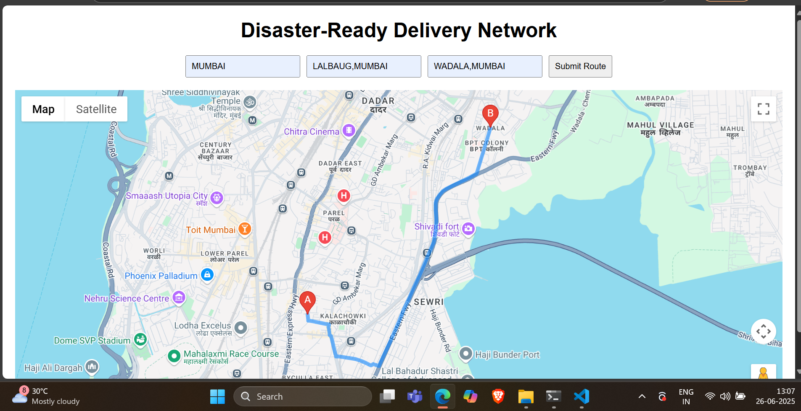
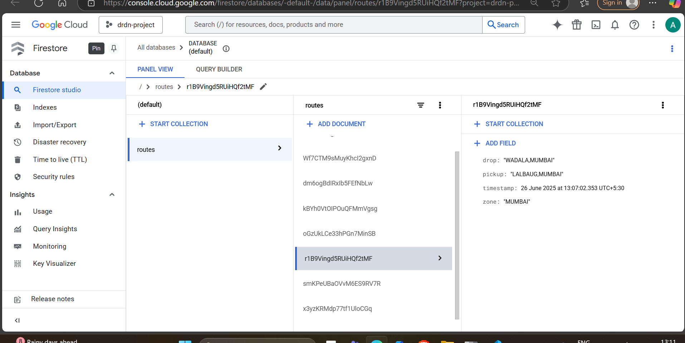
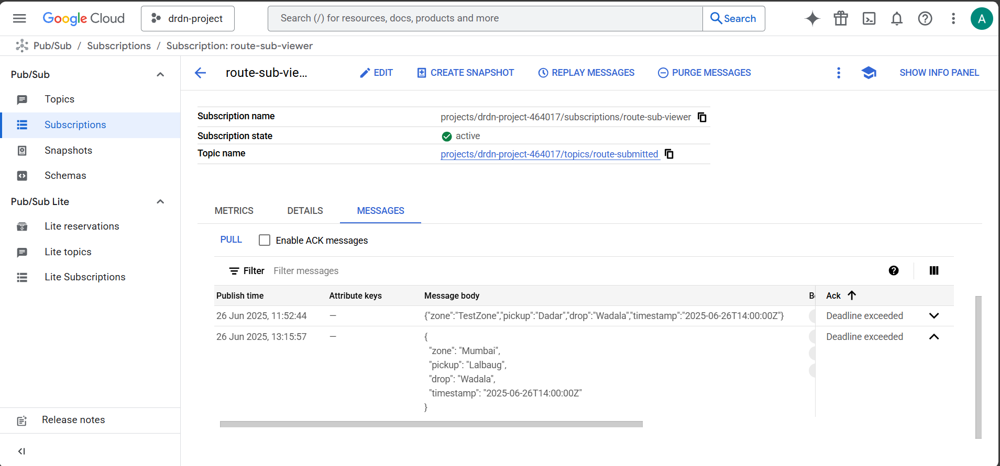
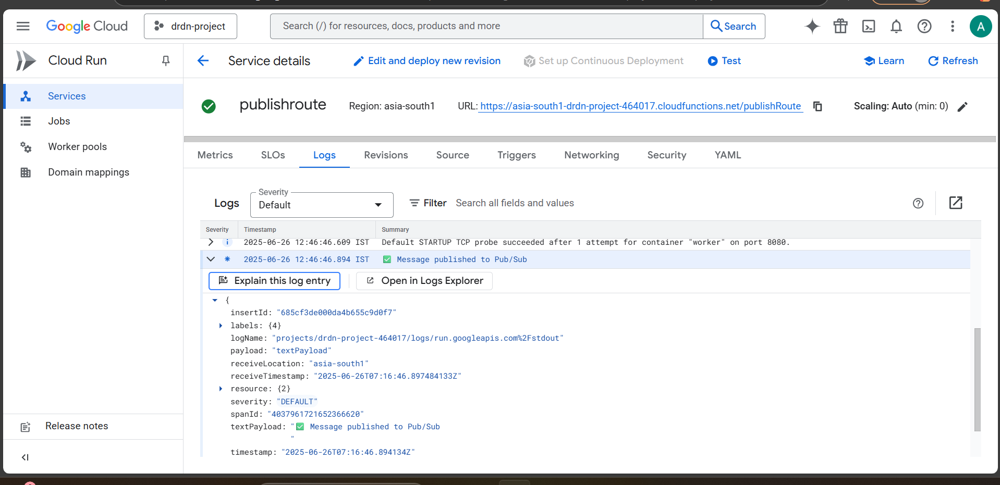
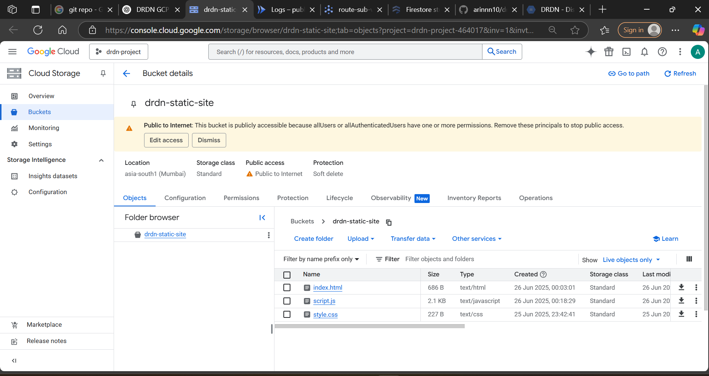

# 🌩️ DRDN - Disaster-Ready Delivery Network (GCP Only)

A cloud-powered disaster response project to visualize and save emergency delivery routes using **only Google Cloud Platform** services.

---

## 🚀 Live Demo

🔗 [Live Project Website](https://storage.googleapis.com/drdn-static-site/index.html)

---

## 🧠 Project Objective

To create a disaster-resilient delivery network that:
- Collects and displays pickup/drop routes
- Saves data securely to the cloud
- Sends route alerts/messages via Pub/Sub

---

## 🛠 Tech Stack

| Layer        | Tool                       |
|--------------|----------------------------|
| Frontend     | HTML, CSS, JS, Google Maps |
| Database     | Firestore (via REST API)   |
| Hosting      | Cloud Storage (Static site)|
| Alerts       | Pub/Sub + Cloud Function   |

---

## ☁️ GCP Services Used

| GCP Service            | Purpose                               |
|------------------------|----------------------------------------|
| **Cloud Firestore**    | Store route data                       |
| **Google Maps API**    | Visualize map and directions           |
| **Cloud Storage**      | Host static site                       |
| **Pub/Sub + Function** | Send & receive delivery alerts         |

---

## 📦 Directory Structure

drdn-gcp/
├── drdn-project/ # Frontend Website
│ ├── index.html # Main web UI
│ ├── style.css # Styling
│ └── script.js # Map + Firestore logic
│
├── drdn-pubsub-function/ # Cloud Function for Pub/Sub
│ ├── index.js # Function logic
│ └── package.json # Dependencies
│
├── output/ # Output Screenshots
│ ├── MAP ROUTE.png
│ ├── FIRESTONE ROUTE ENTRY.png
│ ├── PUB-SUB MSG.png
│ └── CLOUD FUNCTION LOGS.png
│ └── HOSTED WEBSITE.png 
│
└── README.md # This file

## 📸 Screenshots

### 1. Live Disaster Route Map

### 2. Firestore Entry Example

### 3. Pub/Sub Published Message

### 4. Cloud Function Logs

### 5. Hosted Website

---

## 📚 Setup Instructions

1. Enable the following APIs in GCP:
   - Maps JavaScript API
   - Directions API
   - Firestore API
   - Cloud Storage API
   - Pub/Sub API
   - Cloud Functions API

2. Create a Firestore database in **Native Mode**.

3. Host the frontend using Cloud Storage:
   - Upload `index.html`, `style.css`, `script.js`.

4. Deploy Pub/Sub Cloud Function:
   - Use `index.js` with entry point `publishRoute`.

5. Test submission on the hosted website.

---

✅ **All guidelines met**:
- [x] 4+ GCP services
- [x] Problem-solving theme
- [x] Fully GCP compliant (no Firebase)
- [x] Public GitHub repo with documentation and screenshots
